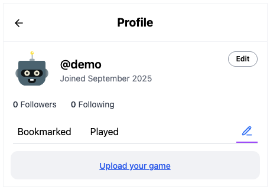
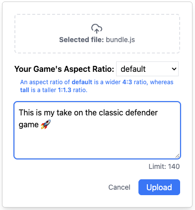
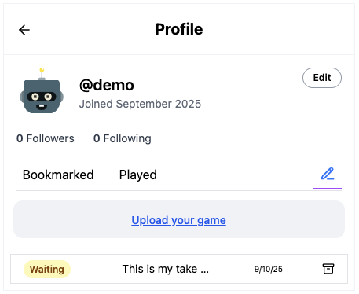
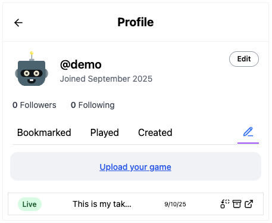

<h1 style={{ display: 'flex', alignItems: 'center', gap: '10px' }}>
    
    Submitting Your Game
</h1>

import { PencilLine } from 'lucide-react';

:::tip
Review the [**submission checklist**](../checklist) before you submit any game.
:::

When you're ready for [**xelly.games**](https://xelly.games) users to play your game,
you can **upload it** from your xelly.games **profile**.

(_Updating_ games is common. Often after you post a game, you'll realize
that you missed a bug or you'll come up with some nice enhancement. If you've already uploaded
or posted your game but want to update it to a new version or fix, read how to do that
[here](./updating).)

## Steps

1. On [your xelly.games profile](https://xelly.games/profile/me),
click the pen icon (<PencilLine size={16} color={"#3B82F6"}/>) to the right
of the tabs:

2. Then click **"Upload your game"** and fill out the modal:

[//]: # (![Upload]&#40;./img/upload.png&#41;)

* Remember to pick the appropriate [**aspect ratio**](./device-dimensions#aspect-ratio) for your game!
* Optionally, you can provide a **comment or instructions** for your game (140 characters max).

3. Now your game will be **waiting moderation**. Sit tight! We try to move quickly
but it can take a couple hours or a day for your game to be approved.

4. Once approved, your game will be **live**! You'll see it marked as **Live**
in your profile.

:::info
If your game is rejected, it will come with a note with the reason why.
You will be able to fix any noted issues, and submit again.
:::
