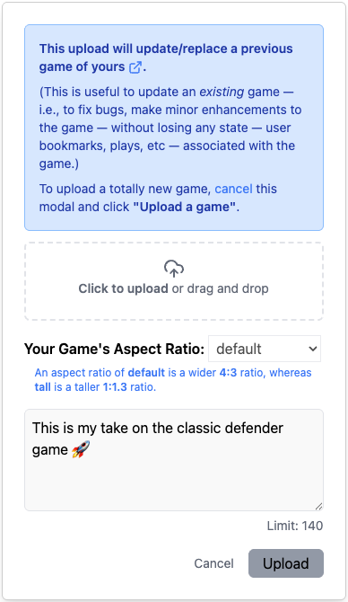

import { Archive, PencilLine, Replace } from 'lucide-react';

<h1 style={{ display: 'flex', alignItems: 'center', gap: '10px' }}>
    
    Updating Your Game
</h1>

At some point, you'll want to update and/or fix one of your games after it's been submitted
and approved &mdash; i.e., to fix a bug, add some nice animations or transitions,
improve the user experience, or just make the game a little bit better somehow.

Of course you could just delete your game and submit a new version but then
everyone who's bookmarked, liked, and played your game would lose that data.

This page explains how to do an "in-place" update to your game.

:::note
* You should only update your game if you have made moderate changes to it &mdash;
for example, bug fixes, usability enhancements and fixes, etc. If your new
version is substantially different, you should submit a new game. Your update
may not be approved if the updates are too substantial.
* If you've submitted a game that's not yet been approved but you want to make
changes to it before it is approved, just **delete** the game using the
archive icon (<Archive size={16}/>) and upload your new version as a new game.
:::

## Steps

1.  On your profile,
click the pen icon (<PencilLine size={16} color={"#3B82F6"}/>) to the right
of the tabs. Then
click the **update/replace** icon (<Replace size={16}/>) to the right
of the game you wish to replace:

    

2. Upload the new version of your game. (Note that you will not be able to
change the [aspect ratio](./device-dimensions#aspect-ratio) or description of your game.)

    

3. Your new game version will then be **waiting moderation**. The current game version
will continue to serve for users until your new version is approved.

    

4. Once your new version is approved, you'll see it reflected in your submitted
list:

    

