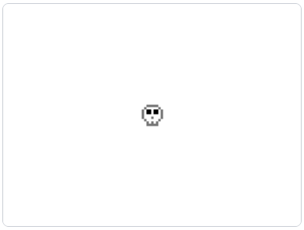
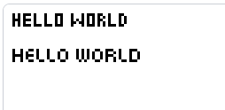
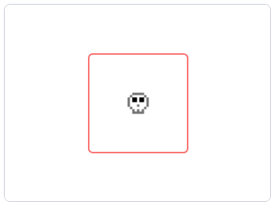
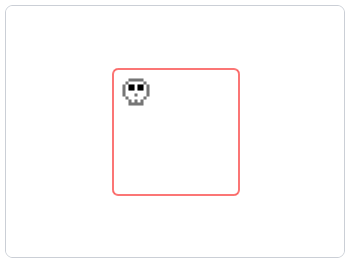
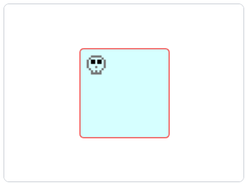
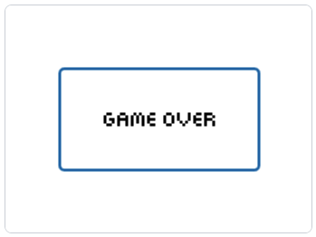

import EmbeddedGame from '../EmbeddedGame';
import {
    urlGameBreakout,
    urlGameFlappyBird,
    urlGameWordZap
} from '../well-knowns';

<h1 style={{ display: 'flex', alignItems: 'center', gap: '10px' }}>
    
    <span>"Pixelized" Games</span>
</h1>

Here's **flappy bird**,
ported from [the ExcaliburJS tutorial games](https://excaliburjs.com/docs/category/tutorial), but given a "pixelized" look:

<div style={{display: 'flex', gap: '10px', flexWrap: 'wrap', marginBottom: '25px'}}>
    <EmbeddedGame
        width={412}
        src={urlGameFlappyBird}/>
</div>

At **xelly.games**, we love to see games with this aesthetic, especially
with a focus on game play over graphics. (Maybe because some of us grew up on
[Game Boys](https://en.wikipedia.org/wiki/Game_Boy)!)

In any case, we've added first-class support in the [`@xelly/xelly.js` SDK](https://github.com/xelly-games/xelly.js)
for making games with pixelized sprites:

## "Pixelized" Sprites

### ASCII Art

We can define a sprite using "ASCII Art":

```typescript
const AsciiSkull = `
      00000
     0     0
    0 11 11 0
    0 11 11 0
    0       0
    0   0   0
     0     0
      0 0 0
      00000
`;
```

To turn this into a [ExcaliburJS graphic](./excaliburjs#graphics), use `xel.graphics.fromAscii`:

```typescript
import * as xel from '@xelly/xelly.js';
import { Actor, Color, Engine, vec, Vector } from 'excalibur';
// ...

const AsciiSkull = ...; // see above

const AsciiSkullPalette = [
    Color.Gray, // 0
    Color.Black // 1
];

// ...
export const install: XellyInstallFunction = (context: XellyContext, engine: Engine) => {

    const graphic
        = xel.graphics.fromAscii(AsciiSkull, AsciiSkullPalette); // !!!

    const skull = new Actor({
        pos: vec(
            Math.floor(engine.drawWidth / 2),
            Math.floor(engine.drawHeight / 2))
    });
    skull.graphics.use(graphic);
    engine.add(skull);

};
// ...
```

This gives us a skull with dark eyes, centered in the view:

<div style={{
    display: "inline-block",
    padding: "10px"
}}>
    
</div>

When creating a sprite from ASCII art, you can:

* Use any non-whitespace character to represent a pixel.
* Provide an optional **palette** (as we did above).
    - When using a palette, any **character** in your
      ascii sprite is given a color from your palette: **characters** `0-9` resolve to
      the first 10 colors in the palette array, `a-z` to the next 26 colors, and `A-Z` the next 26 colors
      after that.

:::info
Any graphic created by `xel.graphics.fromAscii` is **eagerly cropped**; no padding
or spacing will be left around the sprite even if there are spaces in your ascii
representation (as we have in our skull above).

However, you can use `GraphicOptions` (see below) to control more aspects of the
graphic, such as padding, etc.
:::

### Pixelized Text

We can create pixelized text graphics using `xel.graphics.fromText`:

```typescript
xel.graphics.fromText('hello world');

xel.graphics.fromText('hello world', {font: 'font2'});
```

<div style={{
    display: "inline-block",
    padding: "10px"
}}>
    
</div>

### `GraphicOptions`

When creating graphics, we can affect the way the graphic is created using
`GraphicOptions`.

For example, we can override the width and height of the generated graphic.
The following code adds padding and a border around our skull graphic:

```typescript
    const graphic
        = xel.graphics.fromAscii(AsciiSkull, AsciiSkullPalette,
        {
            cssWidthAndHeightOverride: (spriteWidthAndHeight) =>
                vec(spriteWidthAndHeight.x + 100, spriteWidthAndHeight.y + 100),
            borderColor: Color.Red,
            borderWidth: 1,
            borderRadius: 5
        });
```

<div style={{
    display: "inline-block",
    padding: "10px"
}}>
    
</div>

We can use `anchor` and `cssPosition` to position the graphic within its
overridden width and height:

```typescript
    const graphic
        = xel.graphics.fromAscii(AsciiSkull, AsciiSkullPalette,
        {
            // ...
            anchor: Vector.Zero,
            cssPosition: vec(10, 10)
        });
```

<div style={{
    display: "inline-block",
    padding: "10px"
}}>
    
</div>

We can add a background, as well:

```typescript
    const graphic
        = xel.graphics.fromAscii(AsciiSkull, AsciiSkullPalette,
        {
            // ...
            backgroundColor: Color.Teal.lighten(0.9)
        });
```

<div style={{
    display: "inline-block",
    padding: "10px"
}}>
    
</div>

:::tip
`GraphicOptions` are for creating graphics specifically. For example, you should
not use these for normal positioning of `Actor`/entities in your game.

A common use case for overriding the width and height of a graphic is to
create a **message box** or modal, for example:

    
:::

### Sprite Arrays

Above we created `Graphic` instances using `xell.graphics.fromAscii` and
`xel.graphics.fromText`.

There is also `xel.graphics.fromSpriteArray`:

```typescript
// instead of using ascii, define your "pixelated" sprite as a 2D array of [x, y]
// coordinates with [0,0] being the top left
const SkullSprite: [number, number][] = [
    [0, 2], [0, 3], [0, 4], [0, 5],
    [1, 1], [1, 6],
    [2, 0], [2, 2], [2, 3], [2, 7], [2, 8],
    [3, 0], [3, 2], [3, 3], [3, 8],
    [4, 0], [4, 5], [4, 7], [4, 8],
    [5, 0], [5, 2], [5, 3], [5, 8],
    [6, 0], [6, 2], [6, 3], [6, 7], [6, 8],
    [7, 1], [7, 6],
    [8, 2], [8, 3], [8, 4], [8, 5],
];

// ...
    const graphic = xel.graphics.fromSpriteArray(SkullSprite);
// ...
```

We can add a pixel color to any coordinate in the array:

```typescript
const SkullSprite: [number, number][] = [
    [0, 2], [0, 3], [0, 4], [0, 5],
    [1, 1], [1, 6],
    [2, 0], [2, 2, Color.Red], [2, 3, Color.Red], [2, 7], [2, 8],
    [3, 0], [3, 2, Color.Red], [3, 3, Color.Red], [3, 8],
    [4, 0], [4, 5], [4, 7], [4, 8],
    [5, 0], [5, 2, Color.Red], [5, 3, Color.Red], [5, 8],
    [6, 0], [6, 2, Color.Red], [6, 3, Color.Red], [6, 7], [6, 8],
    [7, 1], [7, 6],
    [8, 2], [8, 3], [8, 4], [8, 5],
];

// ...
    const graphic = xel.graphics.fromSpriteArray(SkullSprite);
// ...
```

### Creating Actors Directly

If you don't need access to the graphic itself and you just need
an `Actor` with a graphic, use `xel.actors.*` utilities:

```typescript
    // ...
    const skullActor = xel.actors.fromAscii(AsciiSkull, AsciiSkullPalette);

    const helloActor = xel.actors.fromText('hello!');
    // ...
```

We can also pass both `GraphicOptions` and `ActorArgs` to these functions:

```typescript
    // ...
    const gameOverMessageBox = xel.actors.fromText('game over!', {
        // ActorArgs
        pos: vec(
            Math.floor(engine.drawWidth / 2),
            Math.floor(engine.drawHeight / 2)),
        // GraphicOptions
        cssWidthAndHeightOverride: (spriteWidthAndHeight) =>
            vec(spriteWidthAndHeight.x + 100, spriteWidthAndHeight.y + 100),
        borderColor: Color.ExcaliburBlue,
        borderWidth: 3,
        borderRadius: 5,
        // LabelOptions
        font: 'font2'
    });
    engine.add(gameOverMessageBox);
    // ...
```

### Colliders

[Colliders](https://excaliburjs.com/docs/colliders/) are useful for handling
collisions between entities in your game.

For example, the flappy bird game above uses a collider to detect when the bird
hits the ground or a pipe.

The easiest way to get a collider is to set `height` and `width` (or `radius`)
on your `Actor` &mdash; the Actor will create a simple box (or circle) collider
for you:

```typescript
    // ...
    const graphic
        = xel.graphics.fromAscii(AsciiSkull, AsciiSkullPalette);

    const skull = new Actor({
        pos: vec(
            Math.floor(engine.drawWidth / 2),
            Math.floor(engine.drawHeight / 2)),
        // by setting width and height, we get a box collider on the Actor
        //  and our skull will participate in collision events
        width: graphic.width,
        height: graphic.height
        // note we could also get a circle collider by setting radius:
        // radius: graphic.width / 2
    });
    skull.graphics.use(graphic);
    engine.add(skull);
```

Many times these simple (box or circle) colliders will be sufficient, but
you can also have the xelly.js SDK create a more complex (polygon)
collider for your pixelized sprite:

```typescript
// ...
const spriteArray
    = xel.create.ascii(AsciiSkull, AsciiSkullPalette);

const graphic
    = xel.graphics.fromSpriteArray(spriteArray);

const skull = new Actor({
    pos: vec(
        Math.floor(engine.drawWidth / 2),
        Math.floor(engine.drawHeight / 2))
});
skull.graphics.use(graphic);
// we have to pass the actual sprite array to the colliders.addTo method
//   to have xelly.js generate a polygon collider for the sprite:
xel.colliders.addTo(skull, spriteArray);
engine.add(skull);
```

## Built-in Widgets

### Keyboard

The [`@xelly/xelly.js` SDK](https://github.com/xelly-games/xelly.js) comes with a
pixelized `Keyboard` widget that you can use in your games:

```typescript title="main.ts"
import { Keyboard, ... } from '@xelly/xelly.js';

// ...

export const install: XellyInstallFunction
    = (context: XellyContext, engine: Engine) => {
    const keyboard = new Keyboard(context, {
        minimizer: false,
        animateDepressedKeys: true
    });
    engine.add(keyboard);

    keyboard.on('*keypress', (key: any) => {
        // handle key presses here
        // key is an uppercase letter or 'ENTER' or 'DEL' (for the delete key)
    });

    keyboard.on('initialize', () => {
        // after the keyboard is initialize you can access it's position
        // (the keyboard is laid out at the bottom of the screen)
        console.log(keyboard.pos.y); // e.g.
    });
    // ...
}
```

The example word zap game ([source code](https://github.com/xelly-games/game-examples/tree/main/word-zap))
uses this widget:

<div style={{display: 'flex', gap: '10px', flexWrap: 'wrap'}}>
    <EmbeddedGame
        width={412}
        src={urlGameWordZap}/>
</div>
