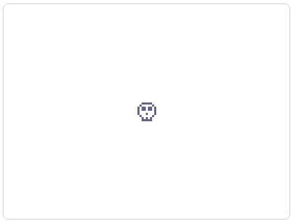

import EmbeddedGame from '../EmbeddedGame';
import {
    urlGameBreakout,
    urlGameFlappyBird,
    urlGameWordZap
} from '../well-knowns';

<h1 style={{ display: 'flex', alignItems: 'center', gap: '10px' }}>
    
    <span>"Pixelized" Games</span>
</h1>

[**@jules**](https://xelly.games/profile/jules) on **[xelly.games](https://xelly.games)** makes games
with a "pixelized" look; here are two &mdash; flappy bird and breakout
ported from [the ExcaliburJS tutorial games](https://excaliburjs.com/docs/category/tutorial):

<div style={{display: 'flex', gap: '10px', flexWrap: 'wrap', marginBottom: '25px'}}>
    <EmbeddedGame
        width={412}
        src={urlGameFlappyBird}/>

    <EmbeddedGame
        width={412}
        src={urlGameBreakout}/>
</div>

:::note
The source code for these two and other "pixelized" games can be found on
[GitHub](https://github.com/xelly-games/game-examples).
:::

We at **xelly.games** would love to see more games with this aesthetic, with a
focus on game play over graphics. (Maybe it's because we miss
our old [Game Boys](https://en.wikipedia.org/wiki/Game_Boy).)
In any case, we've added first-class support for making games like this to the
[`@xelly/xelly.js` SDK](https://github.com/xelly-games/xelly.js) via the
`xel.graphics.fromSprite` function...

## `xel.graphics.fromSprite`

```typescript title="main.ts"
import * as xel from '@xelly/xelly.js';
import {
    XellyContext,
    XellyGameType,
    XellyInstallFunction,
    XellyMetadata
} from '@xelly/xelly.js';
import {Actor, Color, Engine, Font, FontUnit, Label, vec, Vector} from 'excalibur';

// ...

// define your "pixelated" sprite as a 2D array of [x, y]
// coordinates with [0,0] being the top left
const SkullSprite: [number, number][] = [
    [0, 2], [0, 3], [0, 4], [0, 5],
    [1, 1], [1, 6],
    [2, 0], [2, 2], [2, 3], [2, 7], [2, 8],
    [3, 0], [3, 2], [3, 3], [3, 8],
    [4, 0], [4, 5], [4, 7], [4, 8],
    [5, 0], [5, 2], [5, 3], [5, 8],
    [6, 0], [6, 2], [6, 3], [6, 7], [6, 8],
    [7, 1], [7, 6],
    [8, 2], [8, 3], [8, 4], [8, 5],
];

// ...

export const install: XellyInstallFunction
    = (context: XellyContext, engine: Engine) => {

    // add pixelated skull to top left of screen
    const skull = new Actor({
        anchor: Vector.Zero
    });
    skull.graphics.use(xel.graphics.fromSprite(context, SkullSprite));
    engine.add(skull);
}
```

<div style={{
    display: "inline-block",
    padding: "10px"
}}>
    
</div>

We can position (e.g., center) the skull using the dimensions of the graphic produced by `xel.graphics.fromSprite`:

```typescript title="main.ts"
    // ...
    const skull = new Actor({
        anchor: Vector.Zero
    });
    const skullGraphic = xel.graphics.fromSprite(context, SkullSprite);
    skull.graphics.use(skullGraphic);
    skull.pos = vec(
        // using Math.floor() to produce integral coordinates gives a
        //  cripser render on some screens!!!
        Math.floor((engine.drawWidth - skullGraphic.width) / 2),
        Math.floor((engine.drawHeight - skullGraphic.height) / 2));
    engine.add(skull);
    // ...
```

<div style={{
    display: "inline-block",
    padding: "10px"
}}>
    
</div>

That's it! Just a factory for creating pixelized "sprites"/graphics that we can
use for our games.

:::note
Whenever you use pixelized sprite graphics created with `xel.graphics.fromSprite`,
the platform will choose a random color (from a predefined pallete) for your sprite
pixels. This reduces monotony in feeds with many pixelized games.
:::

## Built-in Widgets

### Keyboard

The [`@xelly/xelly.js` SDK](https://github.com/xelly-games/xelly.js) comes with a
pixelized `Keyboard` widget that you can use in your games:

```typescript title="main.ts"
import { Keyboard, ... } from '@xelly/xelly.js';

// ...

export const install: XellyInstallFunction
    = (context: XellyContext, engine: Engine) => {
    const keyboard = new Keyboard(context, {
        minimizer: false,
        animateDepressedKeys: true
    });
    engine.add(keyboard);
    // ...
}
```

The example word zap game ([source code](https://github.com/xelly-games/game-examples/tree/main/word-zap))
uses this widget:

<div style={{display: 'flex', gap: '10px', flexWrap: 'wrap'}}>
    <EmbeddedGame
        width={412}
        src={urlGameWordZap}/>
</div>
